# Whitepops Saathi - New Joiner Training Manual

---

## 1. Welcome

**Saathi** is an AI-powered CRM for managing customer relationships. It syncs with Gmail, classifies emails automatically, and drafts replies for your team.

**App URL:** `https://whitepops-saathi.vercel.app/`

**User Roles:**
| Role | Access |
|---|---|
| **Owner** | Full access to all features |
| **Sales** | Inbox, Pipeline, Customers, Reports |
| **Production** | Inventory and fulfillment focus |

---

## 2. Login & Navigation

Login with your email/password or Google account:

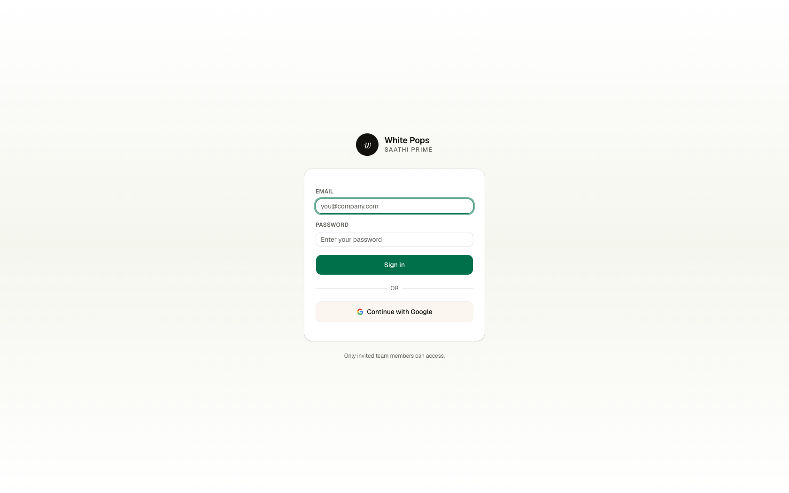

### Sidebar Navigation

The sidebar is organized into four sections:


| Section | Pages |
|---|---|
| **WORK** | Dashboard, Inbox, Pipeline, Customers, Reports |
| **CATALOG** | Products, Inventory, Samples |
| **ADMIN** | Employees (Owner only) |
| **SETUP** | Settings |

---

## 3. Dashboard

Start here each morning. It shows your key metrics and priorities:

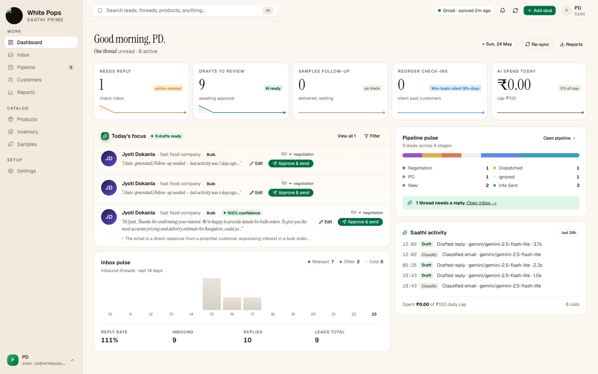

### What you see:

1. **5 KPI Cards** at the top:
   - Needs reply — emails waiting
   - Drafts to review — AI-generated replies ready
   - Samples follow-up — delivered samples needing check-in
   - Reorder check-ins — past customers overdue
   - AI spend today — budget usage

2. **Today's Focus** — your highest priority drafts (Edit or Approve & send)

3. **Pipeline Pulse** — quick view of lead stage distribution

---

## 4. Inbox

This is where you spend most of your day. Three-panel layout:

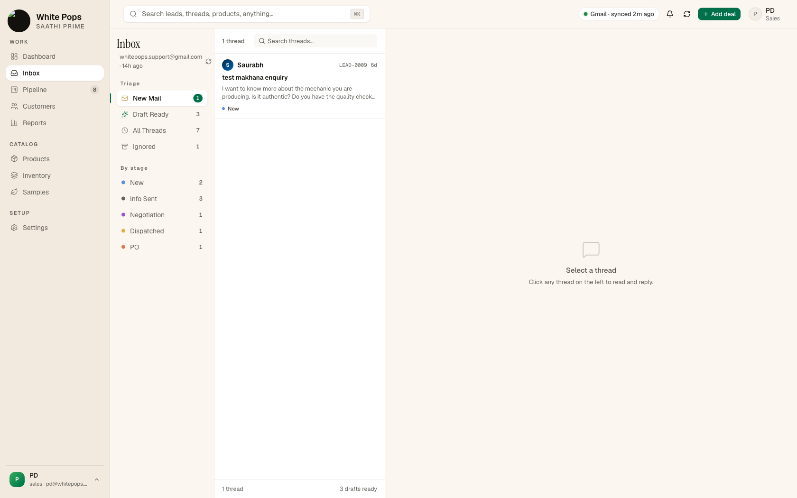

### Workflow for new emails:

1. Click a thread from the middle list
2. If not analyzed, click **Run AI Analysis** (AI classifies as relevant/cold/spam/internal/newsletter)
3. Click **Generate Reply**
4. Review and edit the draft (your edits teach the AI!)
5. Click **Approve & Send**

### Thread View


### Pipeline Stages

Change the stage after every action:

| From | To | When |
|---|---|---|
| New | Info Sent | After your first reply |
| Info Sent | Negotiation | When they ask questions |
| Negotiation | PO | When they send an order |
| PO | Dispatched | After shipping |

---

## 5. Pipeline

Visual Kanban board with 5 stages:

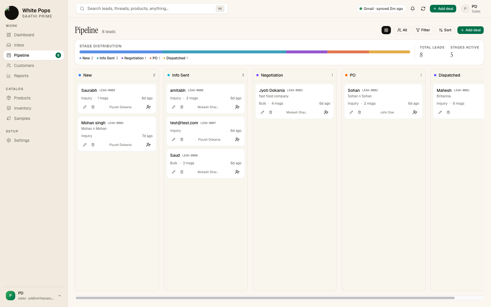

| Stage | Meaning |
|---|---|
| **New** | Fresh lead, no response sent |
| **Info Sent** | You replied with product info |
| **Negotiation** | Discussing price, MOQ, delivery |
| **PO** | Purchase Order received |
| **Dispatched** | Order shipped & delivered |

### Actions:
- Drag & drop cards between columns
- Click **Add deal** to manually create a lead
- Toggle **Mine/All** to filter by assignee

### Create Lead Dialog

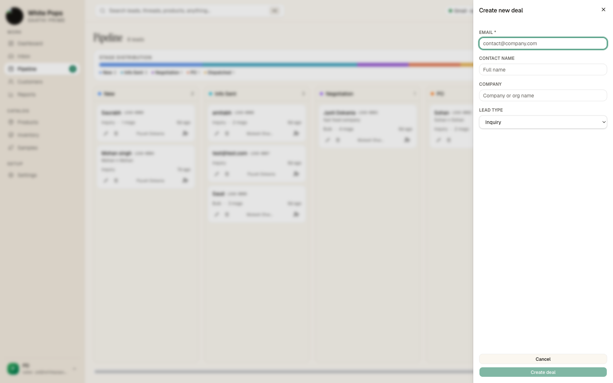

---

## 6. Customers

Qualified companies you do repeat business with. One customer can have multiple leads over time.

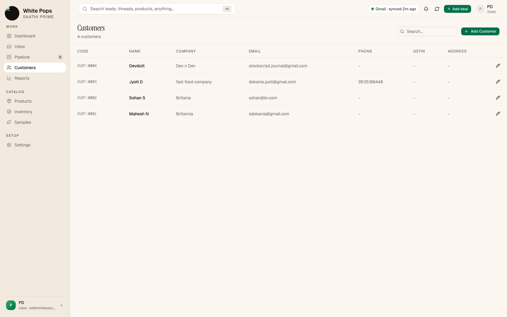

### Add Customer

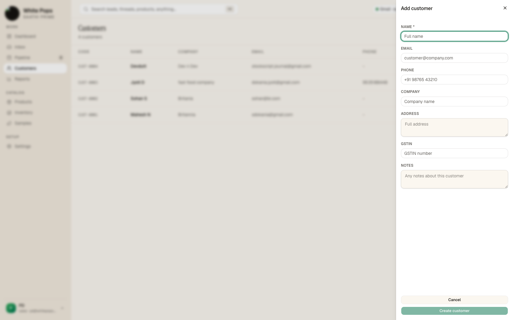

---

## 7. Products

Your product catalog feeds directly into the AI. Keep this accurate.

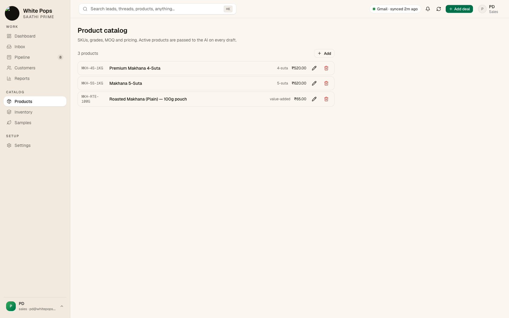

**Fields:** SKU, Name, Grade, Pack Size, MOQ, Retail Price, Wholesale Price

---

## 8. Inventory

Track stock levels and movements (in/out/adjustment).

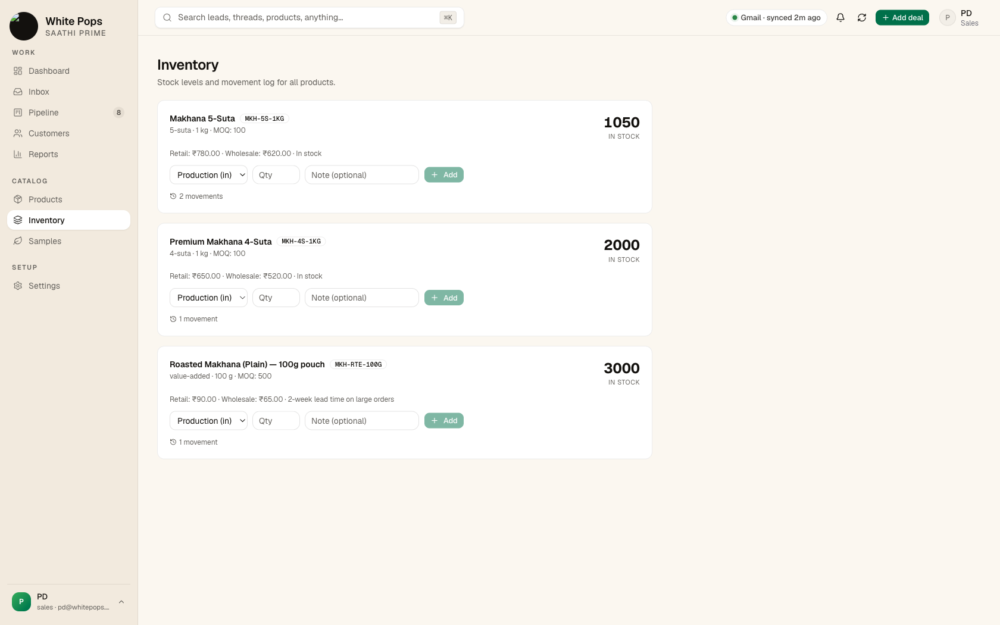

### Add Movement

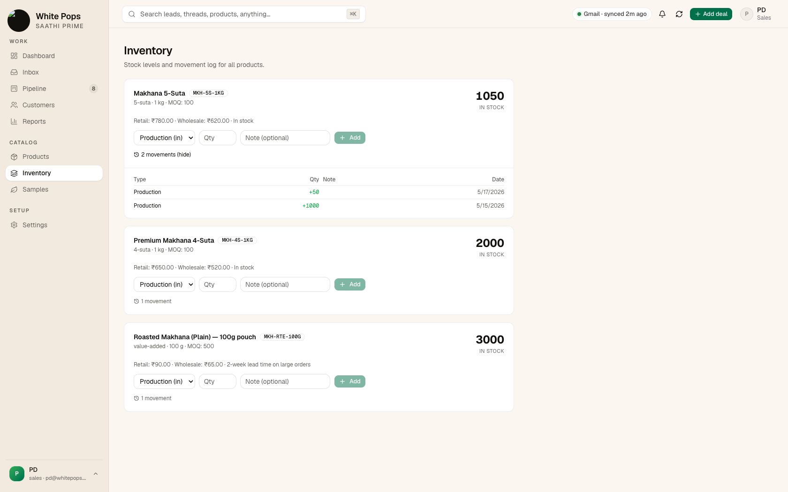

---

## 9. Samples

Track sample shipments to prospects.

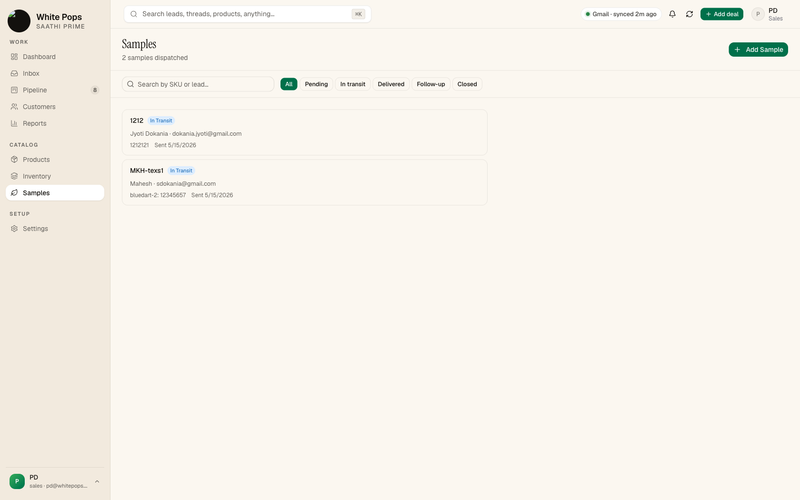

### Status Flow:
1. Pending Dispatch → In Transit → Delivered → Follow-up Sent → Closed

> **Auto Follow-up:** 3 days after marked "Delivered", the AI automatically drafts a check-in email.

### Add Sample Dispatch

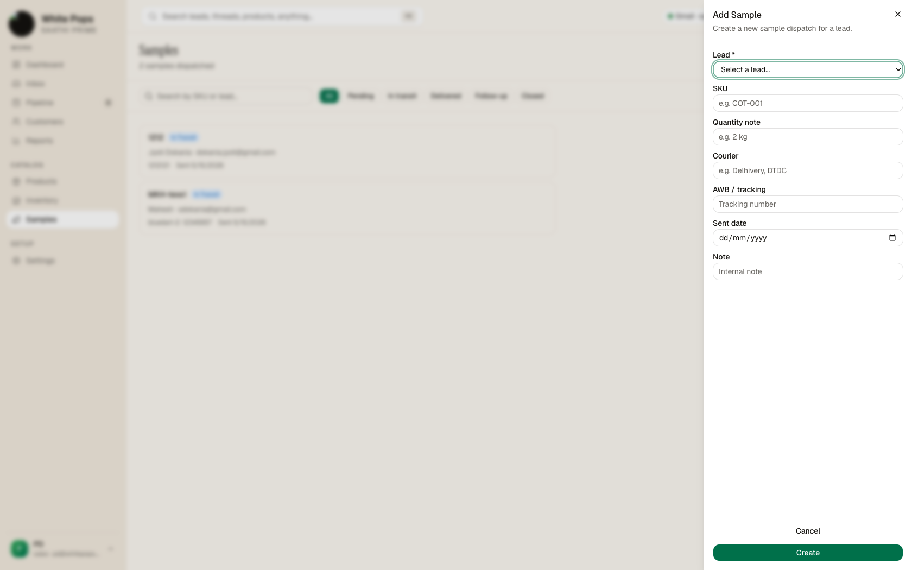

---

## 10. Reports

Analytics with time ranges: 24h / 7d / 14d / 30d / QTD

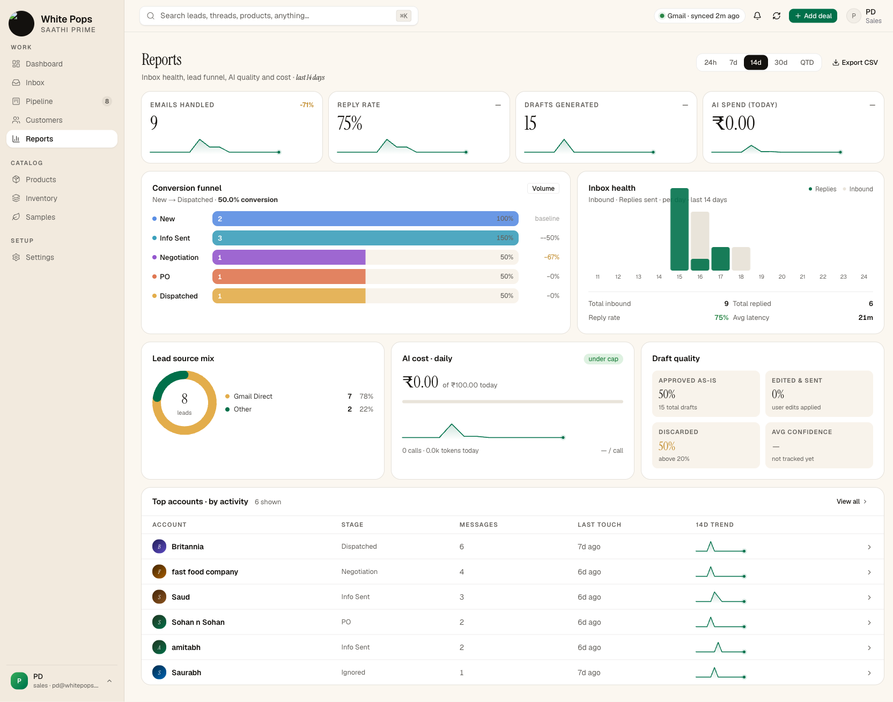

### Key Sections:
- Big Stats — emails handled, reply rate, drafts generated, AI spend
- Conversion Funnel — New → Info Sent → Negotiation → PO → Dispatched
- Inbox Health — daily inbound vs replies
- Source Mix — where leads come from
- Draft Quality — % approved vs edited vs discarded
- Leaderboard — most active leads

---

## 11. Settings

Configure how Saathi works for your business.


### Most Important (Owner only):

**1. Company & Voice** — THE MOST CRITICAL PAGE

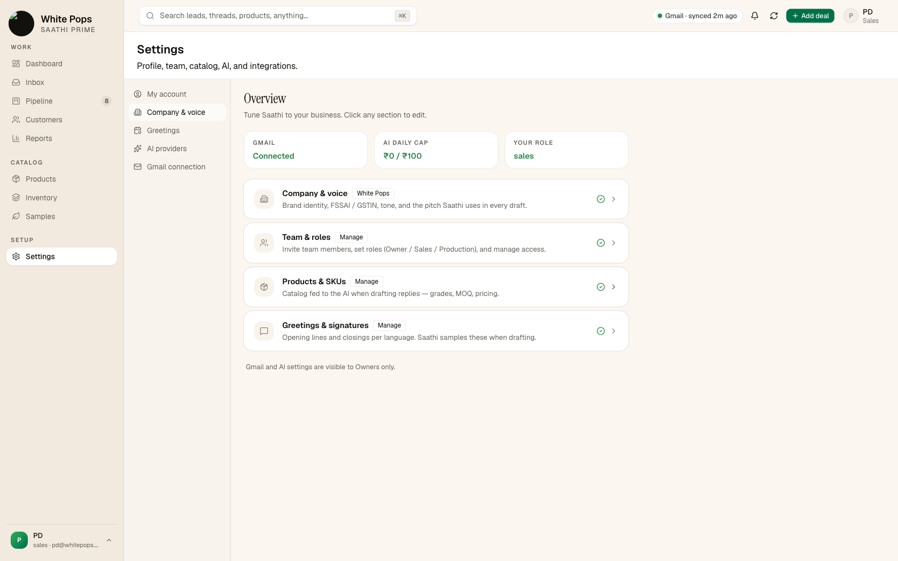

- Company info (GSTIN, FSSAI)
- **Brand Voice** — 5-10 sentences describing how you write. This directly impacts draft quality.
- Follow-up days, reorder nudge days, daily AI cap, inbox keywords

**2. Gmail Connection** — shows which inbox is synced

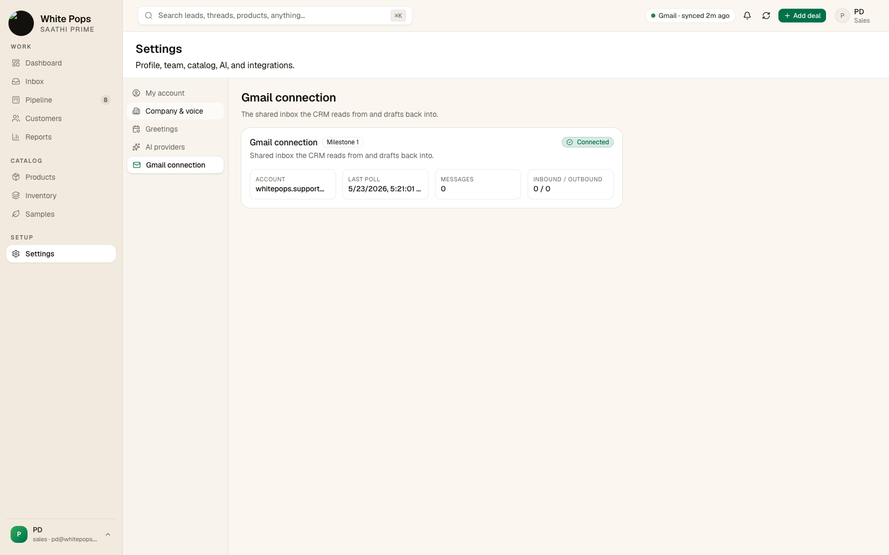

---

## 12. Quick Reference

### Pipeline Flow
```
New → Info Sent → Negotiation → PO → Dispatched
```

### Daily Checklist
- [ ] Check Dashboard for "Needs reply" and "Drafts to review"
- [ ] Inbox → New Mail: process threads
- [ ] Change stage after every reply
- [ ] Check Samples if any delivered

### Common Issues
| Problem | Solution |
|---|---|
| Email not appearing | Wait 2 min or click "Re-Sync" |
| AI draft sounds wrong | Improve **Brand Voice** in Settings |
| AI button disabled | Daily cap reached — wait for tomorrow |

### Glossary
| Term | Meaning |
|---|---|
| **Saathi** | This CRM app (Hindi for "companion") |
| **Lead** | Potential opportunity (LEAD-XXXX code) |
| **Customer** | Qualified repeat contact (CUST-XXXX code) |
| **MOQ** | Minimum Order Quantity |
| **AWB** | Air Waybill (courier tracking) |

---

## 13. First Day Tasks

1. Login and tour: Dashboard → Inbox → Pipeline → Customers → Reports
2. Inbox: open a thread, read a conversation
3. Find a draft in "Draft Ready" and review it
4. Pipeline: understand the 5 stages
5. Ask your Owner for:
   - Your role confirmation
   - Which leads/customers you own
   - How your team uses the stages

---

*Start with **Dashboard** → **Inbox**. Your AI co-pilot is ready.*
